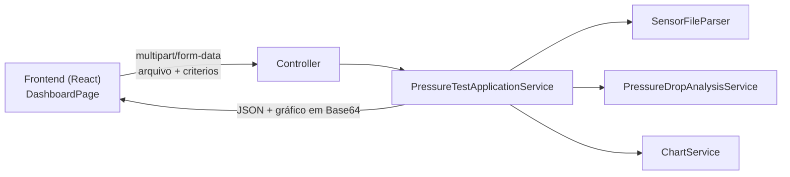

# PressureTestAnalyzer

Aplicação web para automatizar a análise de testes de estanqueidade
(pressure drop test) na indústria de óleo e gás: recebe o arquivo bruto
exportado por um sensor de pressão, calcula a queda percentual no intervalo
definido pelo operador, valida contra o critério de aceitação e gera o
relatório gráfico Pressão x Tempo do ensaio.

## Problema resolvido

Hoje esse processo é feito manualmente: o operador exporta o arquivo `.txt`
do sensor (Teksensor, Additel, ...), importa os dados no Excel, monta o
gráfico de pressão por tempo na mão, localiza os pontos de 0/5/10/15 minutos
do ensaio e calcula a queda percentual para decidir se o teste foi aprovado.
É um processo lento, repetitivo e sujeito a erro humano na hora de localizar
o intervalo certo ou calcular a queda.

O PressureTestAnalyzer automatiza essa análise ponta a ponta: o operador
envia o arquivo do sensor e os critérios de aceitação, e a aplicação devolve
o resultado (aprovado/reprovado), as pressões e a queda calculada, e o
gráfico já com os pontos de controle destacados — pronto para ser conferido
ou anexado a um relatório.

## Principais funcionalidades

- **Leitura de arquivos de sensor** — parser para o formato Teksensor
  (`.txt`, `Data;Hora;Pressao`), com detecção automática do parser compatível
  (arquitetura pronta para novos fabricantes sem alterar o código existente).
- **Cálculo da queda de pressão** — localiza as leituras mais próximas do
  horário inicial e do horário inicial + duração do ensaio, calcula a queda
  absoluta e percentual, e valida contra o critério de aceitação informado.
- **Geração de gráfico Pressão x Tempo** — usando JFreeChart, plota todas as
  leituras, destaca os pontos de controle do intervalo (0, `labelIntervalMinutes`,
  ... até a duração do ensaio) com marcador e label de horário/pressão, e
  exporta em PNG de alta resolução.
- **API REST** que orquestra todo o fluxo (arquivo → parser → análise →
  gráfico) e devolve o resultado em JSON, com o gráfico embutido em Base64.
- **Dashboard web (React + Material UI)** — upload do arquivo, formulário
  dos critérios, exibição do resultado (Aprovado/Reprovado), das pressões e
  da queda percentual, do gráfico gerado, e download do PNG.

**Ainda não implementado** (ver [Status atual](#status-atual-do-projeto) e
[Roadmap](#roadmap)): exportação do relatório em PDF, histórico de análises
anteriores, suporte a outros fabricantes de sensor além do Teksensor, e
autenticação.

## Arquitetura



### Backend (`backend/`)

Camadas em `com.pressuretestanalyzer`, cada uma com uma única responsabilidade:

| Pacote | Responsabilidade | Status |
|---|---|---|
| `controller` | Endpoints REST e tratamento global de exceções | ✅ implementado |
| `service` | Orquestração do fluxo e regras de análise de pressão | ✅ implementado |
| `parser` | Leitura e conversão dos `.txt` exportados pelos sensores | ✅ implementado (Teksensor) |
| `validation` | Validação do critério de aceitação | ✅ implementado |
| `chart` | Geração do gráfico Pressão x Tempo (JFreeChart) | ✅ implementado |
| `model` / `dto` | Entidades de domínio e contratos da API | ✅ implementado |
| `exception` | Exceções de domínio | ✅ implementado |
| `export` | Exportação do relatório em PDF | 🔜 planejado, ainda vazio |
| `repository` | Persistência de histórico de análises (JPA/SQLite) | 🔜 planejado, ainda vazio |
| `config` | Configuração do Spring (CORS, datasource) | 🔜 planejado, ainda vazio |

O fluxo da API (`PressureTestApplicationService`) é: resolver o parser
compatível com o arquivo → converter em `List<PressureRecord>` → rodar
`PressureDropAnalysisService` → gerar o gráfico com `ChartService` → montar a
resposta. Nenhuma camada duplica a lógica de outra.

### Frontend (`frontend/`)

```
src/
├── pages/DashboardPage.tsx   tela única: formulário de análise + resultado
├── services/api.ts           chamada HTTP multipart para a API
├── types/index.ts             tipos TypeScript espelhando os DTOs do backend
├── theme/theme.ts              tema Material UI
├── components/                 (reservado para componentes reutilizáveis futuros)
└── hooks/                      (reservado para hooks customizados futuros)
```

Em desenvolvimento, o Vite faz proxy de `/api` para `http://localhost:8080`
(configurado em `vite.config.ts`), então o navegador só fala com a própria
origem do Vite — não é necessário configurar CORS no backend para rodar
localmente.

## Tecnologias utilizadas

**Backend**
- Java 21 + Gradle (via wrapper, não precisa instalar Gradle)
- Spring Boot 3.3.4 (Web, Validation, Data JPA)
- JFreeChart 1.5.5 — geração do gráfico Pressão x Tempo
- Apache PDFBox 3.0.3 — dependência já incluída para a futura exportação em PDF (ainda não utilizada)
- SQLite + Hibernate Community Dialect — configurado para persistência, ainda sem entidades de negócio
- JUnit 5, AssertJ, Mockito, Spring Boot Test — testes

**Frontend**
- React 19 + TypeScript + Vite
- Material UI (MUI) — componentes e tema
- Axios — cliente HTTP
- react-router-dom — roteamento (hoje com uma única rota, `/`)
- oxlint — lint

## Pré-requisitos

- **Java 21** (JDK) — necessário para rodar o backend
- **Node.js 20+** (recomendado 22 LTS ou superior) e **npm** — necessários para rodar o frontend
- Não é necessário instalar Gradle nem SQLite separadamente: o Gradle Wrapper
  (`gradlew`/`gradlew.bat`) baixa a versão correta, e o banco SQLite é criado
  automaticamente como um arquivo local na primeira execução do backend.

## Como executar o backend

```bash
cd backend
./gradlew bootRun        # Linux/macOS
gradlew.bat bootRun       # Windows
```

O servidor sobe em `http://localhost:8080`. O banco SQLite é criado em
`backend/data/pressure-test-analyzer.db` na primeira execução.

## Como executar o frontend

```bash
cd frontend
npm install
cp .env.example .env      # opcional: só necessário se for apontar para uma API em outro host
npm run dev
```

A aplicação sobe em `http://localhost:5173` e já está configurada (via proxy
do Vite) para conversar com o backend em `http://localhost:8080` sem
necessidade de configuração adicional.

## Endpoint principal da API

```
POST /api/v1/pressure-tests/analyze
Content-Type: multipart/form-data
```

| Campo | Tipo | Descrição |
|---|---|---|
| `file` | arquivo | Arquivo `.txt` exportado pelo sensor |
| `sensorType` | string | Fabricante do sensor (hoje só `TEKSENSOR`) |
| `startTime` | `HH:mm:ss` | Horário inicial do intervalo analisado |
| `durationMinutes` | inteiro > 0 | Duração do ensaio, em minutos |
| `maxDropPercentage` | decimal ≥ 0 | Queda percentual máxima permitida |
| `labelIntervalMinutes` | inteiro > 0 | Intervalo, em minutos, dos pontos destacados no gráfico |

Resposta (`200 OK`):

```json
{
  "startTime": "08:00:00",
  "endTime": "08:15:00",
  "startPressure": 150.00,
  "endPressure": 148.50,
  "pressureUnit": "psi",
  "pressureDrop": 1.50,
  "dropPercentage": 1.00,
  "durationMinutes": 15,
  "maxDropPercentage": 2.00,
  "approved": true,
  "highlightedPoints": [
    { "date": "2026-07-01", "time": "08:00:00", "pressure": 150.00, "unit": "psi" },
    { "date": "2026-07-01", "time": "08:05:00", "pressure": 149.50, "unit": "psi" }
  ],
  "chartBase64": "iVBORw0KGgoAAAANSUhEUgAA..."
}
```

Erros (arquivo inválido, formato não suportado, parâmetros inválidos, etc.)
retornam `400 Bad Request` com o corpo:

```json
{ "status": 400, "error": "Bad Request", "message": "Nenhum parser suporta o arquivo: exemplo.txt" }
```

## Estrutura de pastas

```
PressureTestAnalyzer/
├── backend/
│   ├── src/main/java/com/pressuretestanalyzer/
│   │   ├── controller/     PressureTestController, GlobalExceptionHandler
│   │   ├── service/         PressureTestApplicationService, PressureDropAnalysisService, PressureIntervalLocator
│   │   ├── parser/          SensorFileParser(Resolver), PressureRecord, RawSensorFile, SensorType, teksensor/
│   │   ├── validation/      AcceptanceCriteriaValidator
│   │   ├── chart/           ChartService
│   │   ├── model/           AcceptanceCriteria
│   │   ├── dto/              PressureTestAnalysisRequest/Response, AnalysisResult, ErrorResponse
│   │   ├── exception/       exceções de domínio
│   │   ├── export/           (reservado para exportação em PDF)
│   │   ├── repository/       (reservado para persistência)
│   │   └── config/           (reservado para configuração do Spring)
│   ├── src/test/java/...     testes espelhando o pacote correspondente em main/
│   └── data/                  banco SQLite local (gitignored)
└── frontend/
    └── src/
        ├── pages/DashboardPage.tsx
        ├── services/api.ts
        ├── types/index.ts
        ├── theme/theme.ts
        ├── components/
        └── hooks/
```

## Exemplo do fluxo da aplicação

1. Acesse `http://localhost:5173`.
2. Clique em **Selecionar arquivo .txt** e escolha o arquivo exportado pelo
   sensor.
3. Selecione o sensor (`TEKSENSOR`) e informe horário inicial, duração,
   queda máxima permitida e o intervalo dos pontos destacados no gráfico.
4. Clique em **Analisar**.
5. A aplicação chama a API, que localiza as leituras, calcula a queda e
   monta o gráfico.
6. O resultado aparece na tela: selo **Aprovado**/**Reprovado**, pressões
   inicial/final, queda absoluta e percentual, duração, limite permitido, e
   o gráfico Pressão x Tempo com os pontos de controle destacados.
7. Clique em **Baixar gráfico (PNG)** para salvar a imagem localmente.

## Status atual do projeto

**Implementado e testado:**
- Parser do formato Teksensor e seleção automática de parser
- Cálculo da queda de pressão e validação do critério de aceitação
- Geração do gráfico Pressão x Tempo com pontos de controle destacados
- API REST (`POST /api/v1/pressure-tests/analyze`) com tratamento de erros
- Dashboard web para rodar o fluxo completo pelo navegador

**Ainda não implementado:**
- Exportação do relatório em PDF (pacote `export` reservado, dependência
  PDFBox já incluída)
- Histórico de análises anteriores (pacote `repository` reservado)
- Suporte a outros fabricantes de sensor (ex.: Additel)
- Configuração de CORS no backend para outros ambientes além do dev local
  (hoje resolvido via proxy do Vite)
- Autenticação/autorização

## Roadmap

1. Exportação do relatório técnico completo em PDF (gráfico + dados da
   análise), reaproveitando `ChartService` e `PressureDropAnalysisService`
2. Persistência do histórico de análises (SQLite já configurado, faltam as
   entidades e o repositório)
3. Suporte a um segundo fabricante de sensor (ex.: Additel), validando a
   arquitetura de múltiplos `SensorFileParser`
4. Configuração de CORS/deploy para um ambiente além do dev local
5. Autenticação e controle de acesso, se o caso de uso exigir

## Testes

Backend (JUnit 5 + AssertJ + Spring Boot Test):

```bash
cd backend
./gradlew test
```

Estado atual: **34 testes**, cobrindo parser, validação, cálculo de queda de
pressão, geração do gráfico, orquestração da API e a camada HTTP
(controller + tratamento de erros).

Frontend: ainda não há suíte de testes automatizados configurada (o
`package.json` só tem `dev`, `build`, `lint` e `preview`). O fluxo foi
validado manualmente via navegador durante o desenvolvimento da
`DashboardPage`.

## Aviso: arquivos de sensores reais

**Não versione arquivos `.txt` reais exportados de sensores em campo** —
eles podem conter dados operacionais sensíveis do cliente (poço, unidade,
localização, valores de pressão do ativo). Use apenas arquivos fictícios ou
anonimizados em exemplos, testes e documentação.

Para testes manuais locais, salve arquivos reais em `backend/data/` — essa
pasta já está no `.gitignore` do projeto e não será versionada.
